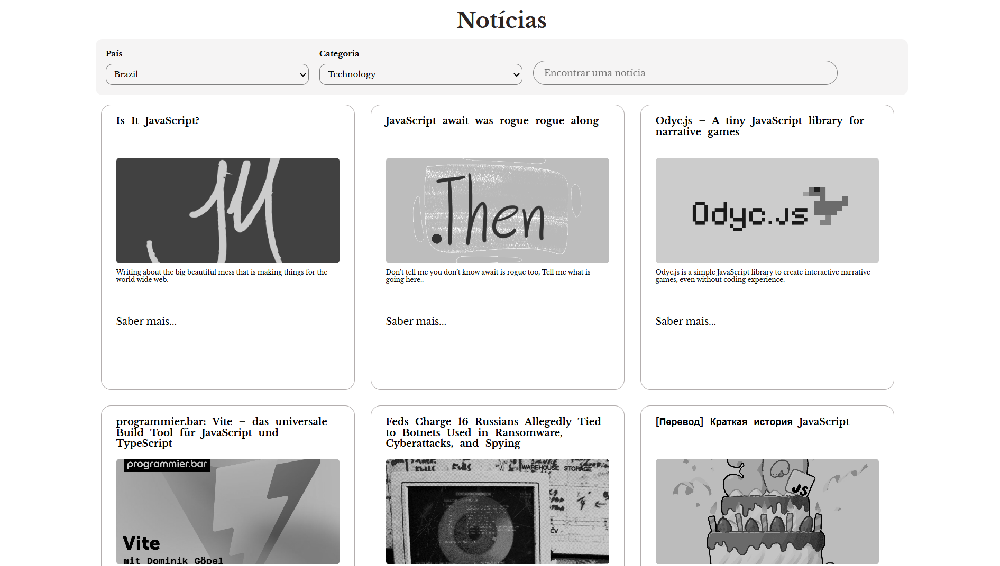

# 🌐 Aplicação Web com ReactJS e Redux

Este repositório contém uma aplicação web desenvolvida com **ReactJS** utilizando **Redux** para gerenciamento de estado e consulta a uma **API externa**.

## 🚀 Tecnologias Utilizadas

- **ReactJS** (CRA - Create React App)
- **Redux** (com `react-redux`)
- **JSX** com **JavaScript**
- **CSS** puro

## 🧠 Funcionalidades

- Consulta dinâmica a uma API externa
- Gerenciamento eficiente de estado global com Redux
- Componentização com JSX
- Estilização simples e organizada com CSS

## 🖼️ Print da Aplicação

Abaixo um print ilustrando a interface da aplicação:

